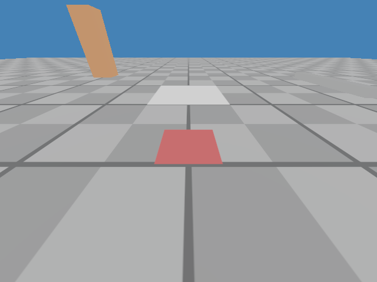
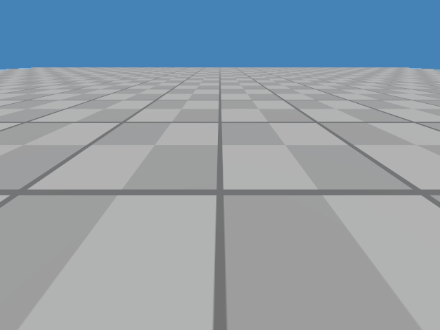
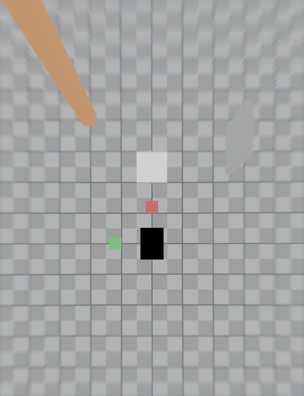

# birdCam — 4-Camera Bird's-Eye-View Simulation Demo

A lightweight, browser-based demo of a **four-camera surround-view system**
for a vehicle / terrain robot: four virtual cameras (front, rear, left,
right) are mounted on a simulated rover, and a classical geometric pipeline
turns their images into a live, metrically-correct top-down **bird's-eye
view (BEV)** — no Unreal/CARLA/Isaac, no neural networks.

```text
4 camera images → camera calibration → ground-plane homography / IPM
                → per-camera BEV patches → stitching / blending → browser
```

## Demo

Live result, generated entirely from the four simulated camera feeds
(never from a top-down ground-truth render):

| Front camera | Rear camera | Bird's-eye view |
|---|---|---|
|  |  |  |

Worth noticing in the BEV image:

- the **checkerboard stays metric** — a 1 m ground square measures
  50 px ± 2 at the 0.02 m/px canvas resolution (enforced by tests);
- **red marker = vehicle +X (forward), green = +Y (left)** — instant visual
  pin of the coordinate conventions;
- the **tall orange box smears radially outward** instead of appearing at
  its true footprint — the fundamental limitation of flat-ground IPM,
  demonstrated on purpose;
- the black hole in the middle is the vehicle itself (no camera sees under it).

## Quick start

```bash
cd bev_web_sim
./install.sh                  # venv + python deps + runs the fast test suite
./run.sh                      # dashboard on http://127.0.0.1:8000 (synthetic source)
```

With the Webots simulator feeding real rendered camera frames:

```bash
cd bev_web_sim
./install.sh --with-webots    # adds: sudo snap install webots
./run.sh webots               # launches Webots + dashboard fed by its cameras
```

The dashboard shows the four camera streams and the live BEV, with controls
for camera pose (height / yaw / pitch / roll / FOV), BEV extent and
resolution, hard vs. soft blending, debug overlays (metric grid, per-camera
coverage, seams, validity mask), obstacle placement, and YAML save/load.
Hovering the BEV reads out vehicle-frame meters under the cursor.

## Repository layout

```text
plan0.md       requirements / objective spec (the "what")
plan1.md       implementation plan + test design derived from the references (the "how")
ref1.md        original reference notes
bev_web_sim/   the application — see bev_web_sim/README.md for full docs
  ├── bev/             pure geometry: camera model, homography, IPM, blending, stitcher,
  │                    synthetic renderer (doubles as the test oracle), debug overlays
  ├── frame_sources/   SyntheticSource | FolderSource | WebotsSource behind one protocol
  ├── web/             FastAPI app: MJPEG streams, config API, dashboard UI
  ├── config/          cameras.yaml / bev.yaml / scene.yaml (pydantic-validated)
  ├── webots/          GENERATED Webots world + rover PROTO (scripts/gen_webots.py)
  └── tests/           ~90 tests: unit, oracle round-trip, metric acceptance,
                       web API, live-Webots integration, browser E2E
demo/          screenshots from a live Webots run
refGits/       reference repo clones (git-ignored, 244 MB) — URLs in plan0.md §8-9
```

## How it works (short version)

Each camera is a pinhole model (optional plumb-bob / fisheye distortion)
with pose configured in the vehicle frame (X forward, Y left, Z up, ground
at Z=0). For the ground plane, projection collapses to a homography
`H = K [r1 r2 t]`. The pipeline precomputes, per camera, a remap look-up
table mapping every BEV pixel's ground point into camera-image coordinates
(with cheirality, image-bounds and range validity); per frame the work is
just one `cv2.remap` per camera plus a distance-transform-weighted blend.
Cameras, configs and pipelines are immutable — a dashboard edit builds a new
pipeline and swaps it atomically.

A key design choice: the **synthetic renderer** draws the four camera views
analytically from the same scene function that also rasterizes a perfect
top-down oracle image. That makes the entire math stack metrically testable
without any simulator — Webots then only has to agree with conventions
already pinned by tests (and it does, to 1.26 px on the 1 m square).

## Tests

```bash
cd bev_web_sim
.venv/bin/python -m pytest -q -m "not webots and not e2e"   # fast lane (~8 s)
.venv/bin/python -m pytest -q -m webots                     # live simulator
.venv/bin/python -m pytest -q -m e2e                        # browser (./install.sh --with-e2e)
```

Current status: **77 fast + 4 webots + 6 e2e tests green, 92 % coverage**
(gate: 80 %). The test design — including the sensitivity guard proving the
metric acceptance test catches a 2° extrinsics error — is documented in
`plan1.md` §10.

## Documentation

- `plan0.md` — the objective: goals, math requirements, scene, phases,
  acceptance criteria.
- `plan1.md` — the implementation plan: what was adopted from each reference
  repo, architecture, module design, full test design, risks.
- `bev_web_sim/README.md` — app-level docs: endpoints, configs, conventions,
  snap-Webots notes, troubleshooting.

## References

Math and implementation references studied for this project (clones live in
the git-ignored `refGits/`):

- [maximm8/birds-eye-view-360-camera](https://github.com/maximm8/birds-eye-view-360-camera) — minimal ground-grid projection
- [ika-rwth-aachen/Cam2BEV](https://github.com/ika-rwth-aachen/Cam2BEV) — config-driven IPM (and a later semantic-BEV path)
- [dyfcalid/CameraCalibration](https://github.com/dyfcalid/CameraCalibration) — precomputed remap LUTs, seam blending
- [xixu-me/AVM](https://github.com/xixu-me/AVM) — fisheye surround-view pipeline
- [MathWorks 360° BEV example](https://www.mathworks.com/help/driving/ug/create-360-birds-eye-view-image.html)
- [Webots](https://cyberbotics.com/) — the simulator
